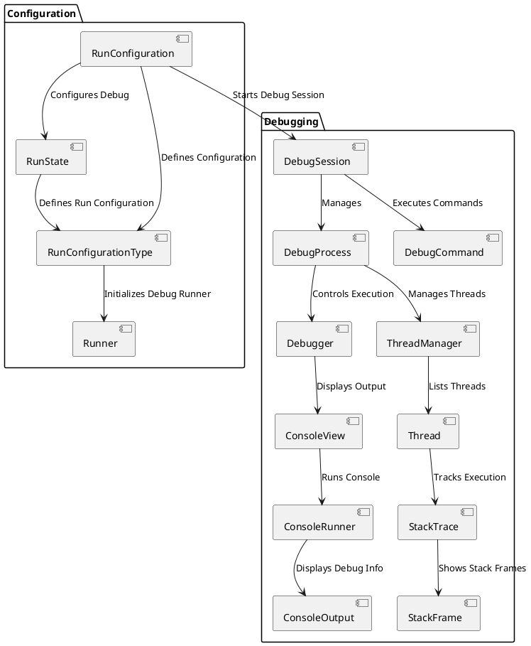

1. 在JAVA代码里编写native函数的声明

   ```java
   public native String getStringFromNative();
   ```

2. 进入到src/main/java 目录下，执行 `javah -jni this.is.a.package.name.classname`, 来生成.h文件。

3. 在app/src/main目录下新建一个文件夹，存放.c和.h文件，将生成的.h文件复制到这里来，删除原来生成的.h文件

4. 在app目录下的build.gradle中，android{}标签内添加，在path中指定CMakeLists的

```xml
externalNativeBuild {

        // Encapsulates your CMake build configurations.
        cmake {

            // Provides a relative path to your CMake build script.
            path "CMakeLists.txt"
        }
    }
```

5. 在app目录下新建CMakeLists.txt，输入以下内容

```xml
# Sets the minimum version of CMake required to build your native library.
# This ensures that a certain set of CMake features is available to
# your build.

cmake_minimum_required(VERSION 3.4.1)

# Specifies a library name, specifies whether the library is STATIC or
# SHARED, and provides relative paths to the source code. You can
# define multiple libraries by adding multiple add_library() commands,
# and CMake builds them for you. When you build your app, Gradle
# automatically packages shared libraries with your APK.

add_library( # Specifies the name of the library.
             JNIStudy

             # Sets the library as a shared library.
             SHARED

             # Provides a relative path to your source file(s).
             src/main/jni/JNIStudy.c )

# Specifies a path to native header files.
include_directories(src/main/jni/)

```

6. 在需要调用的地方加入引用SO的代码

   ```java
   static {
           System.loadLibrary("JNIStudy");
       }
   ```


plantuml

@startuml
actor User

User -> RunConfiguration : "Configure Debug"
RunConfiguration -> RunConfigurationType : "Select Configuration Type"
RunConfiguration -> RunState : "Define Run State"
RunConfigurationType -> Runner : "Run Debugger"
Runner -> DebugSession : "Start Debug Session"
DebugSession -> DebugProcess : "Manage Debug Process"
DebugProcess -> Debugger : "Trigger Debugger Actions"
DebugProcess -> SteppingCommand : "Trigger Step Command"
SteppingCommand -> SteppingHandler : "Handle Step Command"
SteppingHandler -> StepInto : "Step Into"
SteppingHandler -> StepOver : "Step Over"
DebugSession -> ConsoleView : "Show Console Output"
ConsoleView -> ConsoleRunner : "Display Debug Info"
ConsoleRunner -> ConsoleOutput : "Show Output"
DebugProcess -> DebugConsole : "Manage Console"
DebugConsole -> ConsoleView : "Show Log"

@enduml


***********************************************************************

@startuml
package "Debugging" {
  [DebugSession] --> [DebugProcess] : Manages
  [DebugProcess] --> [Debugger] : Controls Execution
  [DebugProcess] --> [ThreadManager] : Manages Threads
  [ThreadManager] --> [Thread] : Lists Threads
  [Thread] --> [StackTrace] : Tracks Execution
  [Debugger] --> [ConsoleView] : Displays Output
  [ConsoleView] --> [ConsoleRunner] : Runs Console
  [ConsoleRunner] --> [ConsoleOutput] : Displays Debug Info
}

package "User Interface" {
  [RunConfiguration] --> [RunState] : Configures Debug
  [RunConfiguration] --> [Runner] : Starts Debug
  [RunState] --> [Runner] : Manages State
}

@enduml


**********************************************************************************

@startuml
actor User

User -> RunConfiguration : "Configure Debug"
RunConfiguration -> RunConfigurationType : "Select Configuration Type"
RunConfiguration -> RunState : "Define Run State"
RunConfigurationType -> Runner : "Run Debugger"
Runner -> DebugSession : "Start Debug Session"
DebugSession -> DebugProcess : "Manage Debug Process"
DebugProcess -> Debugger : "Trigger Debugger Actions"
DebugProcess -> ThreadManager : "Manage Threads"
ThreadManager -> Thread : "List Threads"
Thread -> StackTrace : "Get Stack Trace"
StackTrace -> StackFrame : "Get Stack Frame"
Thread -> DebugCommand : "Trigger Debug Command"
DebugCommand -> SteppingHandler : "Handle Debug Command"
SteppingHandler -> StackTrace : "Update Stack Trace"
SteppingHandler -> ThreadManager : "Switch Threads"
DebugSession -> ConsoleView : "Show Console Output"
ConsoleView -> ConsoleRunner : "Display Debug Info"
ConsoleRunner -> ConsoleOutput : "Show Output"
DebugProcess -> DebugConsole : "Manage Console"
DebugConsole -> ConsoleView : "Show Log"

@enduml


是的，**`RunConfiguration`** 和 **`DebugSession`** 应该是关联的。`RunConfiguration` 定义了调试会话的配置参数，而 **`DebugSession`** 则是实际执行调试的会话实例。二者之间的关联可以理解为：

- **`RunConfiguration`** 包含了调试所需的配置信息（例如，选择的调试目标、调试模式、程序参数等）。
- **`DebugSession`** 负责管理调试会话的生命周期，并根据 `RunConfiguration` 中的设置来启动和管理调试过程。

### 需要关联的原因：
1. **调试配置驱动调试会话**：当你点击 **Run** 或 **Debug** 按钮时，IDE 会根据你选择的 **`RunConfiguration`** 来启动相应的调试会话。`RunConfiguration` 作为调试的配置源，它提供了必要的信息（比如目标 APK、调试参数等），而 `DebugSession` 则根据这些配置开始实际的调试工作。

2. **从配置到会话的过渡**：`RunConfiguration` 定义了调试的基本配置，而 **`DebugSession`** 则是基于这些配置启动调试进程，并控制整个调试过程。二者的关系是配置（`RunConfiguration`）驱动会话（`DebugSession`）的行为。

### 组件图中如何表达这个关联？

在组件图中，**`RunConfiguration`** 和 **`DebugSession`** 之间可以有一个依赖关系或者调用关系，表示 `DebugSession` 会基于 `RunConfiguration` 启动调试会话。

### 调整后的组件图



### 主要调整：
- **`RunConfiguration`** 和 **`DebugSession`** 之间增加了一个关联关系 (`Starts Debug Session`)，表示 `RunConfiguration` 是启动调试会话所需要的配置来源。
  
### 解释：
- **`RunConfiguration`** 提供了调试所需的配置和环境信息，调试会话（**`DebugSession`**）则根据这些配置来启动和管理调试过程。
- 在 `RunConfiguration` 被加载并激活时，它触发 **`DebugSession`** 的创建，后者将基于配置启动相应的调试进程。

### 结论：
`RunConfiguration` 和 `DebugSession` 之间的关联是必要的，因为调试会话的启动和管理是基于配置的。你应该在组件图中明确表示这一点，通过关联关系展示二者的联系。
