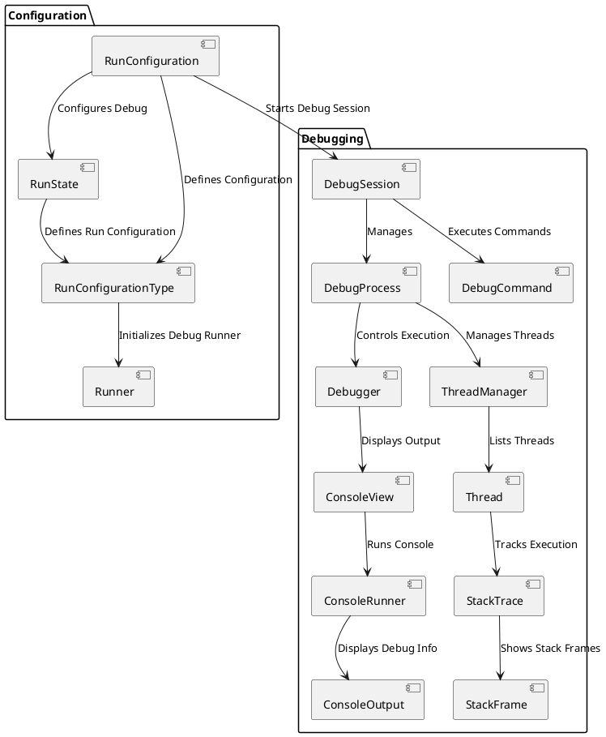

1. 在JAVA代码里编写native函数的声明

   ```java
   public native String getStringFromNative();
   ```

2. 进入到src/main/java 目录下，执行 `javah -jni this.is.a.package.name.classname`, 来生成.h文件。

3. 在app/src/main目录下新建一个文件夹，存放.c和.h文件，将生成的.h文件复制到这里来，删除原来生成的.h文件

4. 在app目录下的build.gradle中，android{}标签内添加，在path中指定CMakeLists的

```xml
externalNativeBuild {

        // Encapsulates your CMake build configurations.
        cmake {

            // Provides a relative path to your CMake build script.
            path "CMakeLists.txt"
        }
    }
```

5. 在app目录下新建CMakeLists.txt，输入以下内容

```xml
# Sets the minimum version of CMake required to build your native library.
# This ensures that a certain set of CMake features is available to
# your build.

cmake_minimum_required(VERSION 3.4.1)

# Specifies a library name, specifies whether the library is STATIC or
# SHARED, and provides relative paths to the source code. You can
# define multiple libraries by adding multiple add_library() commands,
# and CMake builds them for you. When you build your app, Gradle
# automatically packages shared libraries with your APK.

add_library( # Specifies the name of the library.
             JNIStudy

             # Sets the library as a shared library.
             SHARED

             # Provides a relative path to your source file(s).
             src/main/jni/JNIStudy.c )

# Specifies a path to native header files.
include_directories(src/main/jni/)

```

6. 在需要调用的地方加入引用SO的代码

   ```java
   static {
           System.loadLibrary("JNIStudy");
       }
   ```


plantuml

@startuml
actor User

User -> RunConfiguration : "Configure Debug"
RunConfiguration -> RunConfigurationType : "Select Configuration Type"
RunConfiguration -> RunState : "Define Run State"
RunConfigurationType -> Runner : "Run Debugger"
Runner -> DebugSession : "Start Debug Session"
DebugSession -> DebugProcess : "Manage Debug Process"
DebugProcess -> Debugger : "Trigger Debugger Actions"
DebugProcess -> SteppingCommand : "Trigger Step Command"
SteppingCommand -> SteppingHandler : "Handle Step Command"
SteppingHandler -> StepInto : "Step Into"
SteppingHandler -> StepOver : "Step Over"
DebugSession -> ConsoleView : "Show Console Output"
ConsoleView -> ConsoleRunner : "Display Debug Info"
ConsoleRunner -> ConsoleOutput : "Show Output"
DebugProcess -> DebugConsole : "Manage Console"
DebugConsole -> ConsoleView : "Show Log"

@enduml


***********************************************************************

@startuml
package "Debugging" {
  [DebugSession] --> [DebugProcess] : Manages
  [DebugProcess] --> [Debugger] : Controls Execution
  [DebugProcess] --> [ThreadManager] : Manages Threads
  [ThreadManager] --> [Thread] : Lists Threads
  [Thread] --> [StackTrace] : Tracks Execution
  [Debugger] --> [ConsoleView] : Displays Output
  [ConsoleView] --> [ConsoleRunner] : Runs Console
  [ConsoleRunner] --> [ConsoleOutput] : Displays Debug Info
}

package "User Interface" {
  [RunConfiguration] --> [RunState] : Configures Debug
  [RunConfiguration] --> [Runner] : Starts Debug
  [RunState] --> [Runner] : Manages State
}

@enduml


**********************************************************************************

@startuml
actor User

User -> RunConfiguration : "Configure Debug"
RunConfiguration -> RunConfigurationType : "Select Configuration Type"
RunConfiguration -> RunState : "Define Run State"
RunConfigurationType -> Runner : "Run Debugger"
Runner -> DebugSession : "Start Debug Session"
DebugSession -> DebugProcess : "Manage Debug Process"
DebugProcess -> Debugger : "Trigger Debugger Actions"
DebugProcess -> ThreadManager : "Manage Threads"
ThreadManager -> Thread : "List Threads"
Thread -> StackTrace : "Get Stack Trace"
StackTrace -> StackFrame : "Get Stack Frame"
Thread -> DebugCommand : "Trigger Debug Command"
DebugCommand -> SteppingHandler : "Handle Debug Command"
SteppingHandler -> StackTrace : "Update Stack Trace"
SteppingHandler -> ThreadManager : "Switch Threads"
DebugSession -> ConsoleView : "Show Console Output"
ConsoleView -> ConsoleRunner : "Display Debug Info"
ConsoleRunner -> ConsoleOutput : "Show Output"
DebugProcess -> DebugConsole : "Manage Console"
DebugConsole -> ConsoleView : "Show Log"

@enduml


是的，**`RunConfiguration`** 和 **`DebugSession`** 应该是关联的。`RunConfiguration` 定义了调试会话的配置参数，而 **`DebugSession`** 则是实际执行调试的会话实例。二者之间的关联可以理解为：

- **`RunConfiguration`** 包含了调试所需的配置信息（例如，选择的调试目标、调试模式、程序参数等）。
- **`DebugSession`** 负责管理调试会话的生命周期，并根据 `RunConfiguration` 中的设置来启动和管理调试过程。

### 需要关联的原因：
1. **调试配置驱动调试会话**：当你点击 **Run** 或 **Debug** 按钮时，IDE 会根据你选择的 **`RunConfiguration`** 来启动相应的调试会话。`RunConfiguration` 作为调试的配置源，它提供了必要的信息（比如目标 APK、调试参数等），而 `DebugSession` 则根据这些配置开始实际的调试工作。

2. **从配置到会话的过渡**：`RunConfiguration` 定义了调试的基本配置，而 **`DebugSession`** 则是基于这些配置启动调试进程，并控制整个调试过程。二者的关系是配置（`RunConfiguration`）驱动会话（`DebugSession`）的行为。

### 组件图中如何表达这个关联？

在组件图中，**`RunConfiguration`** 和 **`DebugSession`** 之间可以有一个依赖关系或者调用关系，表示 `DebugSession` 会基于 `RunConfiguration` 启动调试会话。

### 调整后的组件图



### 主要调整：
- **`RunConfiguration`** 和 **`DebugSession`** 之间增加了一个关联关系 (`Starts Debug Session`)，表示 `RunConfiguration` 是启动调试会话所需要的配置来源。
  
### 解释：
- **`RunConfiguration`** 提供了调试所需的配置和环境信息，调试会话（**`DebugSession`**）则根据这些配置来启动和管理调试过程。
- 在 `RunConfiguration` 被加载并激活时，它触发 **`DebugSession`** 的创建，后者将基于配置启动相应的调试进程。

### 结论：
`RunConfiguration` 和 `DebugSession` 之间的关联是必要的，因为调试会话的启动和管理是基于配置的。你应该在组件图中明确表示这一点，通过关联关系展示二者的联系。


好的，以下是根据你需求定制的完整报告，用于向领导汇报 **IntelliJ IDEA 调试插件开发项目**，包括项目背景、目标、进展、技术架构、调试界面设计、以及下一步计划。

---

# IntelliJ IDEA 调试插件开发项目报告

## 1. **项目背景与目标**

### 1.1 项目背景
随着移动端和低层调试需求的增加，开发人员越来越需要更高效的调试工具。尤其是在调试 **Android 应用的 `.so` 文件**时，现有工具并未能提供足够的支持，尤其是在 **无源码调试** 的场景下。因此，我们决定开发一款 IntelliJ IDEA 插件，支持使用 **LLDB** 调试安卓应用中的本地库文件（`.so`），以提升调试效率和精准度。

### 1.2 项目目标
本项目的目标是开发一个 **IntelliJ IDEA 插件**，实现对 Android 应用中 `.so` 文件的调试支持。具体目标如下：
- 提供 LLDB 调试功能，支持安卓应用的本地代码调试。
- 实现多线程调试，展示线程堆栈信息。
- 提供反汇编视图，展示调试中的汇编指令。
- 集成调试会话管理，支持调试过程的启动、暂停、单步执行等操作。
- 提供完整的调试界面，包括线程管理、控制台输出和底层调试信息。

## 2. **项目进展**

### 2.1 核心功能实现
- **调试会话管理**：通过 `DebugSession` 管理调试会话，控制调试流程，确保与 LLDB 调试器的无缝连接。
- **调试进程管理**：实现 `DebugProcess`，控制调试进程的启动、暂停、继续等。
- **线程和堆栈信息**：通过 `ThreadManager` 管理线程，使用 `StackTrace` 展示堆栈信息，支持多线程调试。
- **反汇编视图**：集成 LLDB 调试，展示 `.so` 文件的反汇编代码，支持调试命令如 `Step Over`、`Step Into`。
- **控制台输出**：通过 `ConsoleView` 和 `ConsoleRunner` 展示调试过程中的日志输出和错误信息。

### 2.2 调试界面设计
在设计调试界面时，我们特别注重以下几个方面：
- **反汇编视图**：展示调试时的汇编指令，并允许用户单步调试。
- **线程管理**：展示所有线程的状态（运行、暂停、停止），并允许切换查看各线程的堆栈信息。
- **堆栈管理**：展示每个线程的堆栈信息，支持堆栈的展开/折叠查看。
- **调试控制按钮**：提供常见的调试按钮，如 `Step Over`、`Step Into`、`Pause`、`Continue` 等。
- **控制台输出**：展示调试过程中的输出日志、错误信息，并支持日志过滤与搜索功能。

### 2.3 组件图
我们采用了 **UML 组件图** 来展示插件的技术架构及组件之间的关系。以下是插件的主要组件及其交互关系：


### 2.4 已完成的功能模块
- **`DebugSession`**：已实现基本的调试会话管理功能，能够启动、暂停和控制调试过程。
- **`DebugProcess`**：已与 LLDB 调试器集成，支持调试进程的控制和管理。
- **`ThreadManager`** 和 **`StackTrace`**：已展示调试过程中各线程的堆栈信息，支持堆栈查看和线程切换。
- **反汇编视图**：反汇编代码展示已完成，能够同步展示程序执行的汇编指令。
- **控制台输出**：控制台已集成，支持调试过程中日志输出与过滤。

## 3. **技术架构与实现**

### 3.1 主要技术栈
- **Java**：用于开发 IntelliJ IDEA 插件，结合 IntelliJ SDK 提供的 API 实现调试功能。
- **LLDB**：作为调试工具，与 IntelliJ 插件进行集成，用于调试安卓应用中的 `.so` 文件。
- **UML 组件图**：用于描述插件内部的组件及其关系，确保各模块的协同工作。

### 3.2 架构设计
插件的架构分为三个主要层次：
1. **调试层（Debugging Layer）**：负责调试会话、调试进程、线程管理等。
2. **配置层（Configuration Layer）**：负责调试配置管理，使用 `RunConfiguration` 和 `RunState` 管理调试配置。
3. **UI 层（UI Layer）**：提供调试界面，包括反汇编视图、线程管理、堆栈信息等，通过 `ToolWindow` 组织各个视图控件。

### 3.3 调试界面控件设计
- **反汇编视图**：显示当前执行的汇编指令，支持 `Step Over` 和 `Step Into` 等调试命令。
- **线程管理视图**：列出当前调试会话中的所有线程，并展示每个线程的执行状态。
- **堆栈视图**：展示当前线程的堆栈帧信息，帮助用户理解程序执行路径。
- **控制台视图**：展示调试输出，包括程序输出、日志信息、错误消息等。

## 4. **关键挑战与解决方案**

### 4.1 多线程调试
**挑战**：多线程调试涉及多个线程的执行状态、堆栈信息展示等，需要精准同步。
**解决方案**：通过 `ThreadManager` 模块管理线程，使用 `StackTrace` 模块展示每个线程的堆栈信息，确保多线程调试的准确性。

### 4.2 LLDB 集成
**挑战**：LLDB 调试器的集成可能遇到与 IntelliJ 的调试流程不兼容的问题。
**解决方案**：通过 `Debugger` 和 `DebugProcess` 模块进行适配，确保 LLDB 调试器能够无缝嵌入 IntelliJ 插件中。

### 4.3 调试过程控制
**挑战**：确保调试进程的顺畅控制，包括断点、单步调试等。
**解决方案**：通过 `DebugSession` 管理调试会话，提供清晰的调试流程和操作反馈。

## 5. **下一步计划**

### 5.1 功能优化
- **反汇编视图**：进一步增强反汇编指令的高亮显示，优化代码的可读性。
- **堆栈管理**：增加更多的堆栈信息，尤其是涉及复杂数据结构的调试过程。

### 5.2 性能优化
- 提高调试界面的响应速度，确保大规模应用中的调试操作流畅无卡顿。

### 5.3 集成测试
- 完成插件的单元测试和集成测试，确保插件在不同调试场景下的稳定性。

### 5.4 用户反馈与迭代
- 启动用户测试，收集反馈并进行插件的迭代优化，改进用户体验。

## 6. **总结与展望**

目前，插件的核心功能已经基本完成，并能够支持 Android 应用 `.so` 文件的调试，展示线程堆栈信息、反汇编视图和调试输出。下一步将继续优化调试命令、提高插件的性能，并进行全面的测试与迭代。项目的成功实施将大大提高开发人员调试低层应用代码的效率，尤其是在多线程和低层次调试的场景下。

---

### 附件：
- **项目架构图**（UML 组件图

）
- **调试界面设计草图**
- **技术文档与API说明**

---

以上就是完整的报告内容，可以根据具体的需求进行调整与补充。如果你有更多的信息或细节需要添加，可以随时告诉我！
